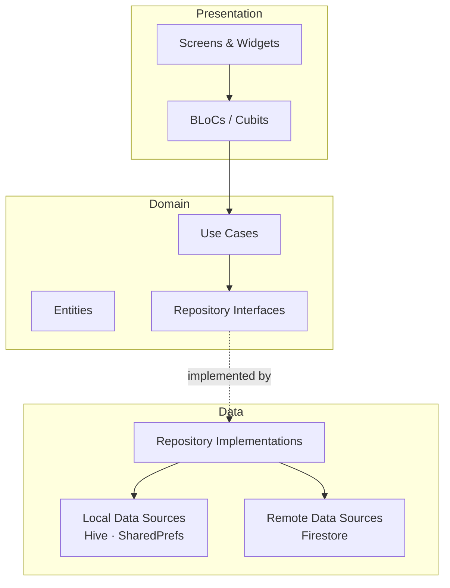
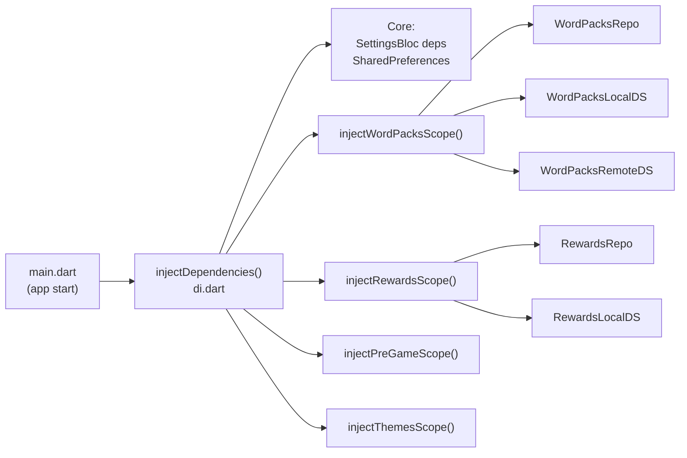
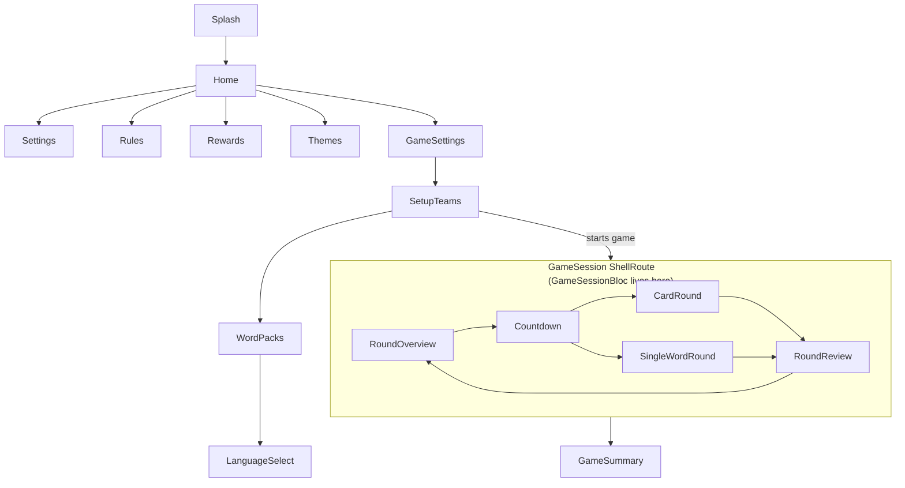
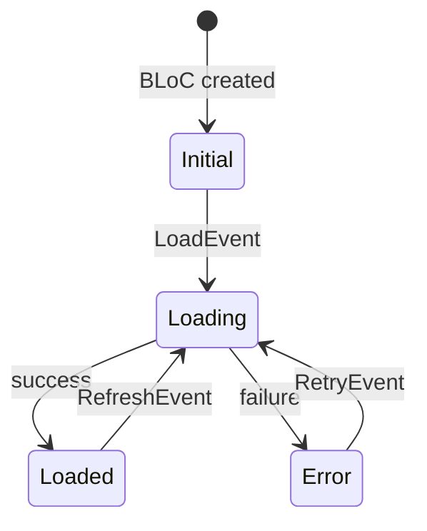
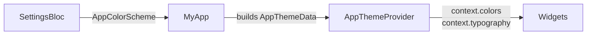

# Bardak — Architecture Overview

Bardak is a Flutter word-guessing board game app (Alias) built on **Clean Architecture**
with **BLoC** state management, **GetIt** dependency injection, and **GoRouter** navigation.

---

## Layer Model

### Rules

| Layer | Allowed imports | Forbidden imports |
|-------|----------------|-------------------|
| `domain/` | Pure Dart, other domain types | Flutter, `dart:ui`, data layer |
| `data/` | Domain interfaces, third-party SDKs | presentation layer |
| `presentation/` | Domain use cases, entities | repositories, data sources directly |

---

## Dependency Injection

GetIt is the service locator. The single global instance (`sl`) is configured at app start
and composed through feature scope functions.

**Composition roots** — the only places that call `sl<T>()`:

- `lib/utils/dependency_injection/di.dart` — core setup + delegates to feature scopes
- `lib/*_scope.dart` files — register feature-specific services
- `lib/router/app_router.dart` — route-scoped `BlocProvider` in `pageBuilder`
- `lib/main.dart` — global `MultiBlocProvider` for app-wide BLoCs

---

## Navigation (GoRouter)

All routes live in `lib/router/app_router.dart`. Route paths and names are
`static const` values on the owning screen class.

A **ShellRoute** wraps all in-game screens so `GameSessionBloc` persists across
round navigation without rebuilding.

---

## State Management (BLoC)

### Global BLoCs (alive for app lifetime)

| BLoC / Cubit | Responsibility |
|---|---|
| `SettingsBloc` | App & game settings persistence |
| `WordPacksBloc` | Word pack caching and loading |
| `PreGameBloc` | Team names, game mode selection |
| `ThemesBloc` | Purchased theme tracking |
| `RewardsCubit` | Coin balance management |

### Route-scoped BLoCs (created in `pageBuilder`)

| BLoC | Scope | Created from |
|---|---|---|
| `GameSessionBloc` | Game session shell | `GameSessionScreen` builder |
| `RoundReviewBloc` | Review screen | `RoundReviewScreen` pageBuilder |
| `CardRoundBloc` | Card round screen | `CardRoundScreen` pageBuilder |
| `SingleWordRoundBloc` | Single word screen | `SingleWordRoundScreen` pageBuilder |

### BLoC Event/State pattern

Events and states are `sealed` classes extending `Equatable`.
Async handlers declare explicit concurrency transformers
(`restartable` / `droppable` / `sequential`).

---

## Theme System

`AppThemeProvider` (InheritedWidget) wraps the app and provides the active theme.
Color scheme is driven by `SettingsBloc`. 15 color schemes are implemented.

Access tokens only through context extensions — never use raw `Color(...)` or
`TextStyle(...)` in widget code.

---

## Storage Strategy

| Data | Storage | Feature |
|------|---------|---------|
| Game settings | SharedPreferences | `settings` |
| App settings (locale, theme) | SharedPreferences | `settings` |
| Word packs | Hive (local cache) | `word_pack` |
| Word pack source of truth | Firestore | `word_pack` |
| Coin balance | SharedPreferences | `rewards` |
| Purchased themes | SharedPreferences | `themes` |
| Team names | SharedPreferences | `pre_game` |
| Game session state | In-memory only | `game_session` |

---

## Localisation

Three locales supported: **English (en)**, **Russian (ru)**, **Armenian (am)**.
Generated via `flutter gen-l10n` from `lib/localizations/l10n/`.
Active locale is persisted in `AppSettingsEntity` and applied via `SettingsBloc`.

---

## Code Generation

| Tool | Produces | Trigger |
|------|----------|---------|
| `flutter_gen_runner` | `lib/assets/assets.gen.dart`, `lib/assets/fonts.gen.dart` | `dart run build_runner build` |
| `flutter gen-l10n` | `lib/localizations/l10n/app_localizations*.dart` | `flutter pub get` |

No `freezed` or `json_serializable` — models are hand-written.

---

## Key Dependencies

| Category | Package | Version |
|----------|---------|---------|
| State | `flutter_bloc` | 9.1.1 |
| State | `equatable` | 2.0.8 |
| DI | `get_it` | 9.2.1 |
| Navigation | `go_router` | 17.3.0 |
| Firebase | `firebase_core`, `cloud_firestore` | 4.x / 6.x |
| Local storage | `hive_flutter`, `shared_preferences` | 2.x / 2.5.5 |
| UI | `cached_network_image`, `confetti`, `gradient_borders` | latest |
| Audio | `audioplayers` | 6.7.0 |
| Linting | `very_good_analysis` | 10.2.0 |
| SDK | Dart `≥3.12.1`, Flutter `≥3.44.1` | |
