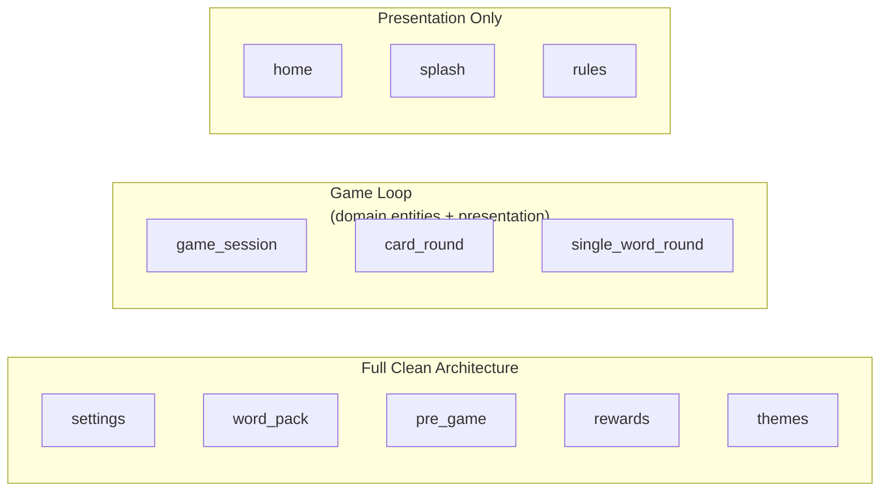
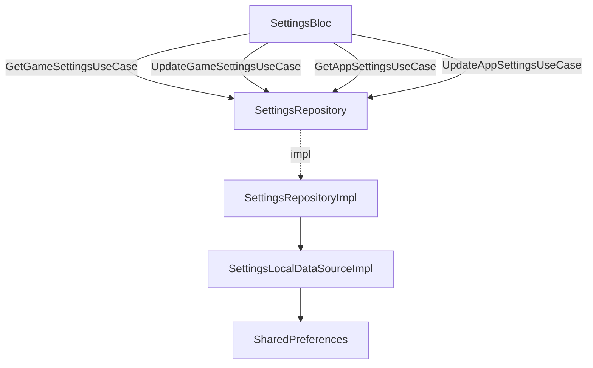
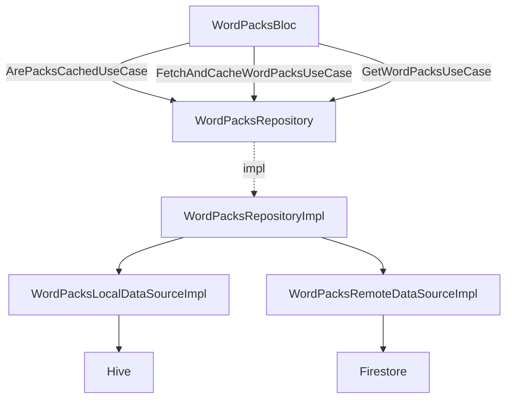
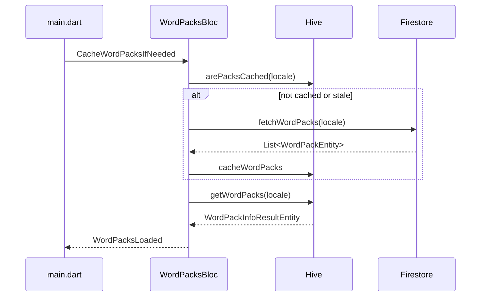
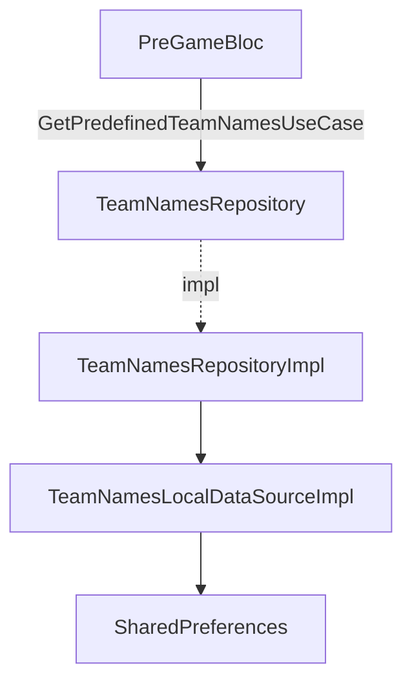
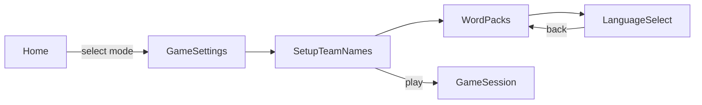
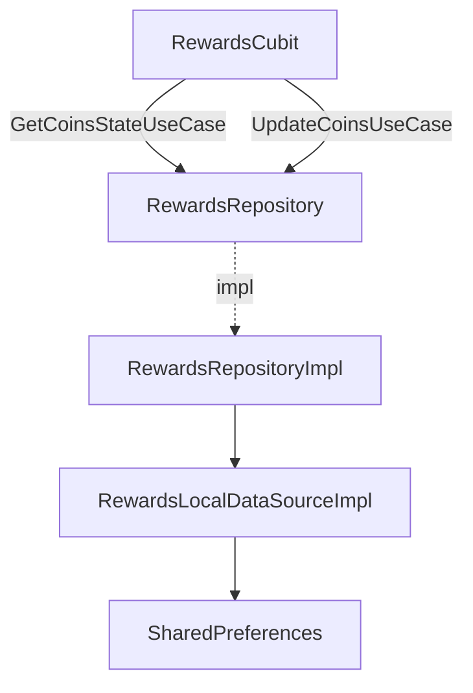
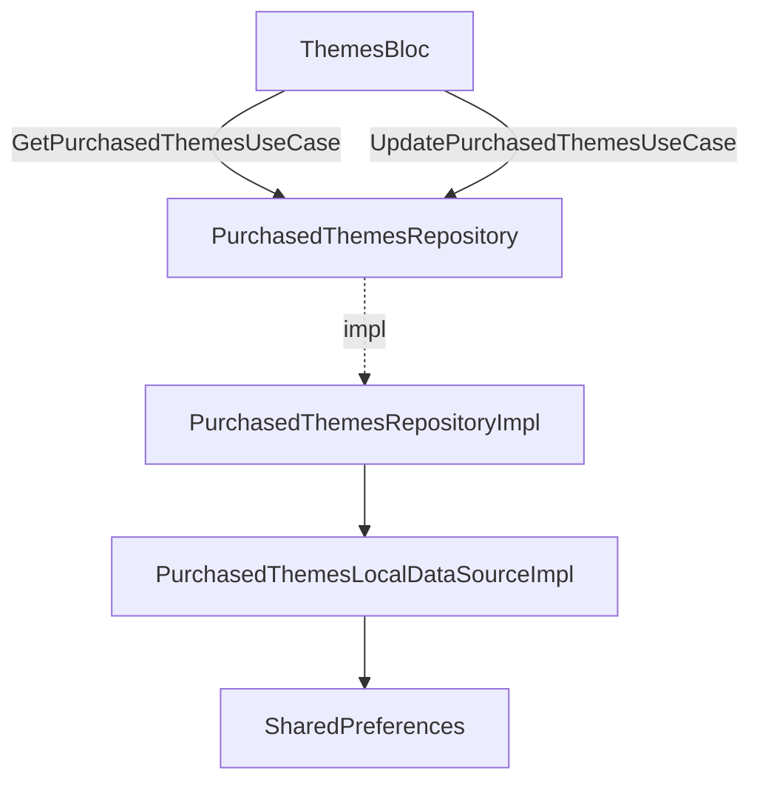
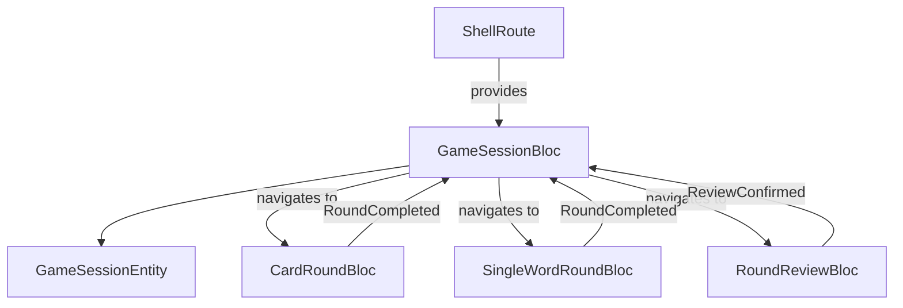
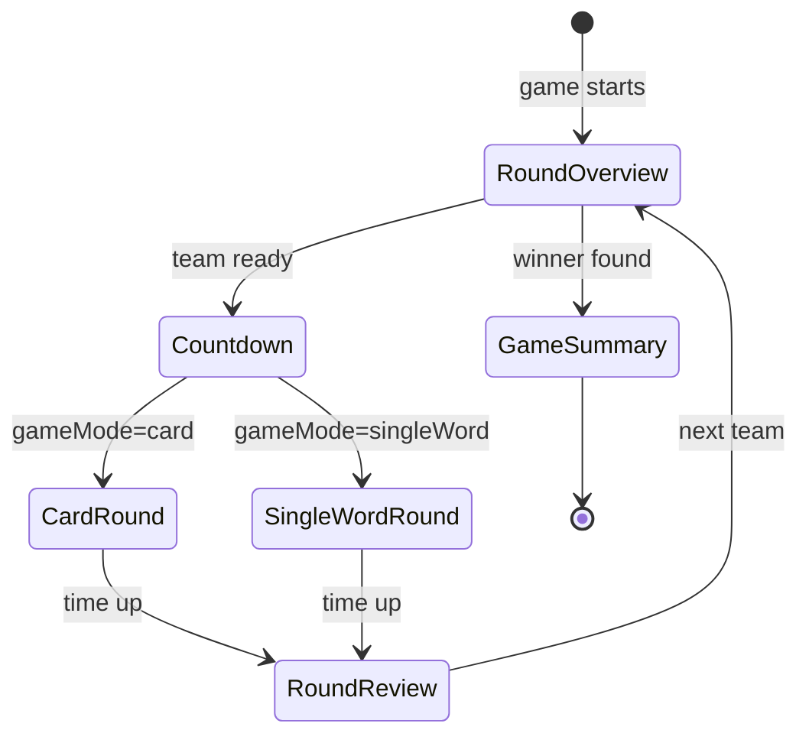

# Bardak — Implemented Features

12 modules are implemented. 5 have full Clean Architecture (domain + data + presentation),
4 are game-loop modules (domain entities + presentation only), and 3 are presentation-only.

---

## Feature Map



---

## 1. Settings

Persists and provides game rules and app preferences (locale, color theme, sound).

**Layer diagram**



**Entities**

- `AppSettingsEntity` — locale (`AppLocale`), color scheme (`AppColorScheme`)
- `GameSettingsEntity` — `roundDuration`, `pointsToWin`, `allowSkipping`,
  `penaltyForSkipping`, `wordsPerCard`

**Use Cases** (4)

| Use Case | Direction |
|---|---|
| `GetAppSettingsUseCase` | read |
| `UpdateAppSettingsUseCase` | write |
| `GetGameSettingsUseCase` | read |
| `UpdateGameSettingUseCase` | write |

**BLoC states**

```
SettingsState(appSettings, gameSettings)   ← single state class with copyWith
```

**Screens:** `SettingsScreen`, `AppLanguagesList`

---

## 2. Word Pack

Fetches word packs from Firestore and caches them in Hive for offline play.
Supports per-locale packs with sync detection.

**Layer diagram**



**Entities**

- `WordPackEntity` — `id`, `name`, `words: List<String>`, `image`, `imageBlurHash`
- `WordPackInfoResultEntity` — `packs: List<WordPackEntity>`, locale
- `WordPacksFallbacks` — static fallback packs when network unavailable

**Use Cases** (3)

| Use Case | Notes |
|---|---|
| `ArePacksCachedUseCase` | checks Hive + sync staleness |
| `FetchAndCacheWordPacksUseCase` | Firestore → Hive |
| `GetWordPacksUseCase` | reads from Hive cache |

**BLoC states** (sealed)

```
WordPacksInitial
WordPacksLoaded(packs, locale)
WordPacksNotCached(fallbackPacks, error?)   ← degraded offline mode
```

**Startup flow**



**Screens:** `WordPackScreen`, `LanguageSelectScreen`

---

## 3. Pre-Game Setup

Collects game mode, team names, and word pack selection before starting a session.

**Layer diagram**



**Entity**

- `PreGameEntity` — `gameMode: GameMode`, `teams: List<String>`, selected word pack & locale

**Game modes:** `cardRound`, `singleWord`

**BLoC states** (sealed)

```
PreGameInitial
PreGameLoaded(preGameEntity)
PreGameUpdated(preGameEntity)
```

**Screens:** `GameSettingsScreen`, `SetupTeamNamesScreen`

**Pre-game navigation flow**



---

## 4. Rewards

Coin balance system with a daily mystery box mechanic.

**Layer diagram**



**Entity**

- `CoinBalanceEntity` — `coins: int`, `boxesDay: DateTime`, `openedBoxes: Map<int,bool>`
  - Auto-normalizes daily box state on deserialization
  - `fromJson`/`toJson` for SharedPreferences persistence

**Use Cases** (2)

| Use Case | Notes |
|---|---|
| `GetCoinsStateUseCase` | sync read, returns entity |
| `UpdateCoinsUseCase` | writes updated balance |

**Cubit** (not Bloc — simple method-driven state machine)

```
CoinBalanceEntity   ← state is the entity directly
```

Methods: `getCoinsState()`, `addCoins(amount)`, `openBox(boxIndex)`

**Screen:** `RewardsScreen`

---

## 5. Themes

Unlockable color theme system. Users spend coins to unlock themes.

**Layer diagram**



**Color schemes** (15 implemented)

`main`, `purple`, `yellow`, `blue`, `green`, `pink`, `red`, `dark`,
`turquoise`, `orange`, `brown`, `navy`, `mint`, `plum`, `grey`

Each is an `AppColors` subclass providing `main` gradient, `firstGradient`,
`secondGradient`, `secondary`, and semantic colors (`green`, `red`, etc.).

**Use Cases** (2)

| Use Case | Notes |
|---|---|
| `GetPurchasedThemesUseCase` | returns `List<AppColorScheme>` |
| `UpdatePurchasedThemesUseCase` | persists newly purchased scheme |

**BLoC states**

```
ThemesState(purchasedThemes: List<AppColorScheme>)
```

**Screen:** `ThemesScreen`

---

## 6. Game Session

Orchestrates a full Alias game: team rotation, round tracking, score accumulation,
and win condition detection. State is **in-memory only** — no persistence layer.

**Layer diagram**



**Entities**

- `GameSessionEntity` — full mutable game state
  - `teamStates: List<AliasTeamStateEntity>`
  - `currentTeamIndex`, `currentRoundIndex`
  - `words: List<String>`, `pendingReviewWords`
  - `isGameFinished`, `winningTeamIndex`
  - Business logic: `getWinningTeamIndex()`, `pagedReviewedWords()`
- `AliasTeamStateEntity` — `name`, `roundScores: List<int>`, computed `totalScore`
- `RoundResult` / `ReviewedWord` — per-word outcome after a round

**Game flow state machine**



**Win condition:** first team to reach `pointsToWin`; ties extend play until one
team leads at round end.

**Screens:** `GameSessionScreen` (shell), `RoundOverviewScreen`, `CountdownScreen`,
`RoundReviewScreen`, `GameSummaryScreen`

---

## 7. Card Round

Displays a card of multiple words simultaneously. Player marks each as guessed or skipped.
Words and settings are passed from `GameSessionBloc` at route creation time.

**Entity**

- `CardRoundEntity` — `words: List<String>`, `wordsPerCard: int`, `soundsEnabled: bool`

**BLoC events** (sealed)

```
ToggleWord(wordIndex, isGuessed)
CompleteRoundRequested
```

**BLoC states** (sealed)

```
CardRoundInitial
CardRoundInProgress(currentCard, remainingWords, guessedCount, timer)
CardRoundCompleted(reviewedWords, score)
```

**Screen:** `CardRoundScreen`

---

## 8. Single Word Round

Shows one word at a time with a running countdown. Supports skipping with optional
penalty scoring.

**Entity**

- Single-word round configuration passed via constructor (no entity class)

**BLoC events** (sealed)

```
StartRound
WordGuessed
WordSkipped
RoundTimerTick
CompleteRound
```

**BLoC states** (sealed)

```
SingleWordRoundInitial
SingleWordRoundInProgress(currentWord, remainingSeconds, score)
SingleWordRoundCompleted(reviewedWords, score)
```

**Screen:** `SingleWordRoundScreen`

---

## 9. Home

Entry point after splash. Displays game modes and navigates to settings, rewards, and themes.

- No domain or data layer.
- Reads `WordPacksBloc` and `SettingsBloc` state to enable/disable game start.
- **Screen:** `HomeScreen`

---

## 10. Splash

Initial loading screen. Waits for dependencies and navigates to `HomeScreen`.

- **Screen:** `SplashScreen`

---

## 11. Rules

Static screen showing Alias game rules. Content is localized.

- **Screen:** `RulesScreen`

---

## Feature × Layer Matrix

| Feature | domain/entities | domain/repos | domain/usecases | data/sources | data/repos | presentation/bloc | presentation/ui |
|---------|:-:|:-:|:-:|:-:|:-:|:-:|:-:|
| settings | ✅ | ✅ | ✅ (4) | ✅ SharedPrefs | ✅ | ✅ Bloc | ✅ |
| word_pack | ✅ | ✅ | ✅ (3) | ✅ Hive + Firestore | ✅ | ✅ Bloc | ✅ |
| pre_game | ✅ | ✅ | ✅ (1) | ✅ SharedPrefs | ✅ | ✅ Bloc | ✅ |
| rewards | ✅ | ✅ | ✅ (2) | ✅ SharedPrefs | ✅ | ✅ Cubit | ✅ |
| themes | — | ✅ | ✅ (2) | ✅ SharedPrefs | ✅ | ✅ Bloc | ✅ |
| game_session | ✅ | — | — | — | — | ✅ Bloc ×2 | ✅ |
| card_round | ✅ | — | — | — | — | ✅ Bloc | ✅ |
| single_word_round | — | — | — | — | — | ✅ Bloc | ✅ |
| home | — | — | — | — | — | — | ✅ |
| splash | — | — | — | — | — | — | ✅ |
| rules | — | — | — | — | — | — | ✅ |
